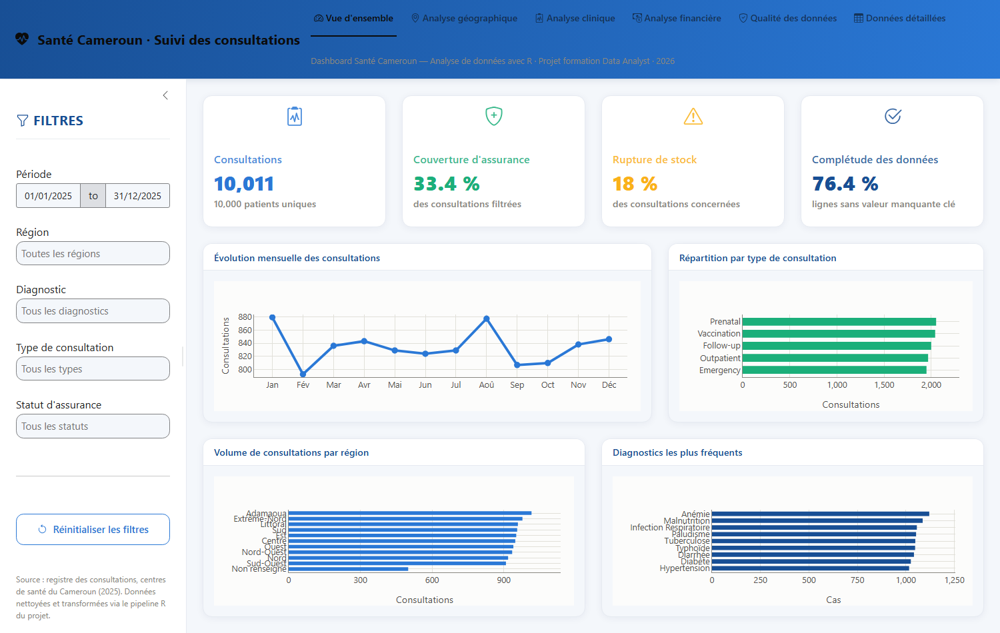
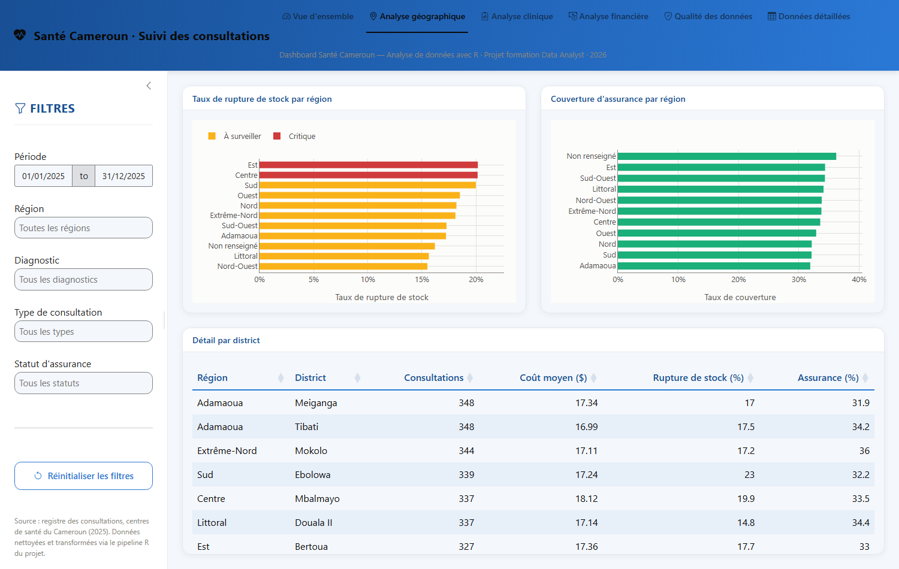
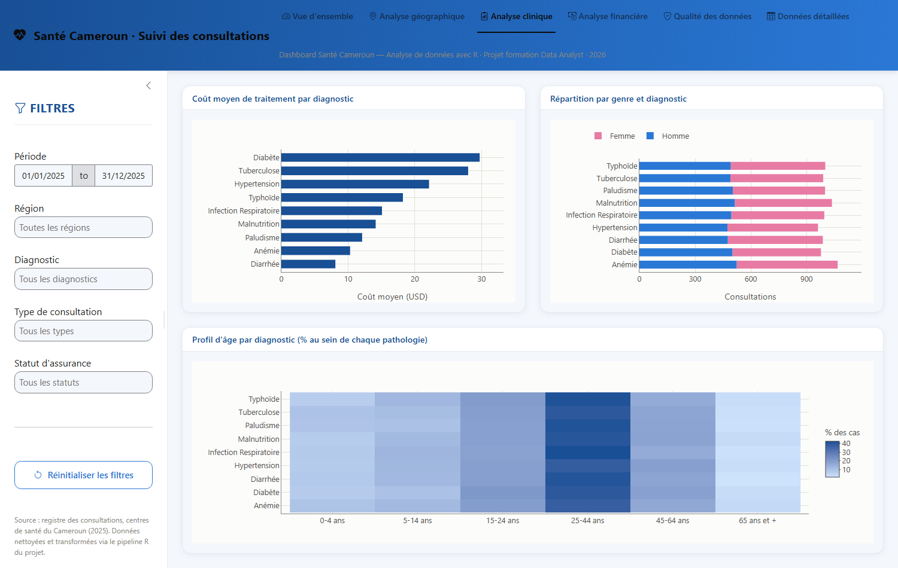
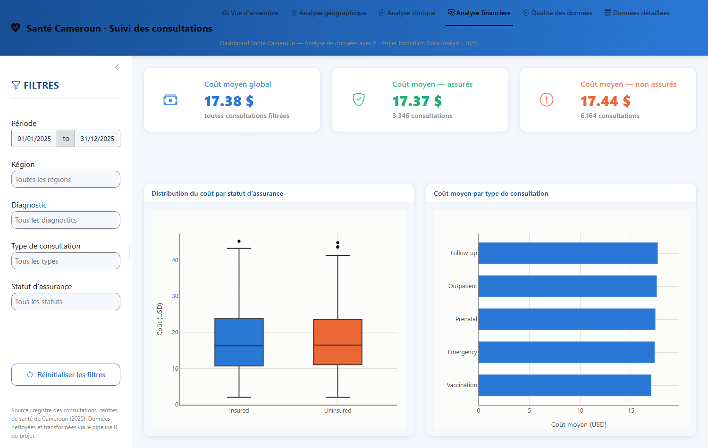
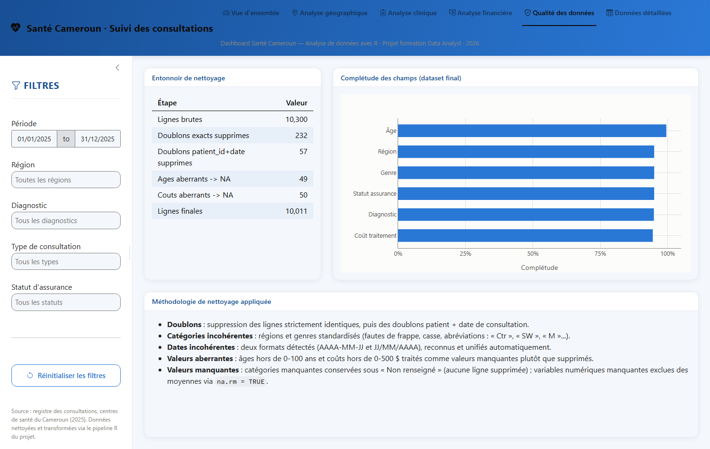

# 🏥 Santé Cameroun — Analyse de données & Dashboard Shiny

Projet complet d'analyse de données en **R** : d'un jeu de données réel-simulé et
volontairement « sale » (valeurs manquantes, doublons, fautes de frappe, dates
incohérentes, valeurs aberrantes) jusqu'à un **dashboard interactif** et un
**rapport de recommandations**, en suivant le workflow complet d'un(e) Data Analyst :

```
Import → Exploration → Nettoyage → Transformation → Analyse business
       → Visualisation → Statistiques descriptives → Dashboard → Reporting → Recommandations
```

Le jeu de données simule les consultations enregistrées dans **150 établissements
de santé**, répartis dans les **10 régions du Cameroun**, sur l'année 2025
(10 300 lignes brutes).

## Aperçu du dashboard



<table>
<tr>
<td></td>
<td></td>
</tr>
<tr>
<td></td>
<td></td>
</tr>
</table>

Le dashboard propose 6 vues (Vue d'ensemble, Analyse géographique, Analyse clinique,
Analyse financière, Qualité des données, Données détaillées), des filtres dynamiques
(période, région, diagnostic, type de consultation, statut d'assurance), et un export
CSV des données filtrées — avec une charte graphique clinique moderne (bslib +
palette validée accessibilité).

## Résultats clés

| Constat | Valeur |
|---|---|
| Consultations valides après nettoyage | **10 011** (sur 10 300 lignes brutes) |
| Couverture d'assurance | **33 %** seulement — homogène entre régions (problème structurel) |
| Taux de rupture de stock de médicaments | **18 %** en moyenne, **≥ 20 %** dans les régions Est, Centre et Sud |
| Coût des maladies chroniques | **2 à 3× supérieur** à celui des pathologies infectieuses aiguës |
| Complétude des données après nettoyage | **76 %** des lignes sans aucune valeur manquante clé |

<table>
<tr>
<td></td>
<td></td>
</tr>
</table>

📄 Le détail complet (méthodologie, tous les graphiques, tableaux et les 5
recommandations opérationnelles) est dans **[rapport/rapport_final.html](rapport/rapport_final.html)**.

## Structure du projet

```
Sante Cameroun/
├── data/
│   ├── consultations_cameroun.csv        # dataset brut (10 300 lignes, source)
│   └── clean/                            # généré par les scripts 02-03
├── scripts/
│   ├── 00_utils.R                        # constantes, palette, fonctions partagées
│   ├── 01_import_exploration.R           # étapes 1-2 : audit des données brutes
│   ├── 02_nettoyage.R                    # étape 3 : nettoyage documenté
│   ├── 03_transformation.R               # étape 4 : nouvelles variables
│   ├── 04_analyse_business.R             # étape 5 : réponses aux questions métier
│   ├── 05_visualisation.R                # étape 6 : graphiques ggplot2
│   ├── 06_statistiques_descriptives.R    # étape 7 : statistiques résumées
│   └── 07_preparer_deploiement.R         # rend app/ autonome pour le déploiement
├── resultats/
│   ├── figures/                          # 9 graphiques PNG (générés par 05)
│   └── tables/                           # tables de résultats CSV (générées par 04, 06)
├── app/
│   ├── app.R                             # étape 8 : dashboard Shiny
│   ├── www/styles.css                    # charte graphique du dashboard
│   └── manifest.json                     # pour déploiement Posit Cloud / Connect / shinyapps.io
├── rapport/
│   ├── rapport_final.Rmd                 # étapes 9-10 : reporting + recommandations
│   └── rapport_final.html                # rapport rendu
└── README.md
```

## Prérequis

- R ≥ 4.3 (testé avec R 4.6.1)
- Packages : `tidyverse` (dplyr, readr, tidyr, stringr, lubridate, ggplot2, scales,
  forcats), `shiny`, `bslib`, `bsicons`, `plotly`, `DT`, `rmarkdown`, `knitr`, `kableExtra`

```r
install.packages(c("dplyr","readr","stringr","lubridate","tidyr","ggplot2","scales",
                    "forcats","shiny","bslib","bsicons","plotly","DT","rmarkdown",
                    "knitr","kableExtra"))
```

Pour rendre `rapport_final.Rmd`, **Pandoc** doit être installé (fourni avec RStudio ;
sinon `winget install JohnMacFarlane.Pandoc` sous Windows, ou `rmarkdown::install_pandoc()`).

## Exécution locale

Tous les scripts s'exécutent **depuis la racine du projet** (chemins relatifs) :

```r
source("scripts/01_import_exploration.R")   # audit du dataset brut (console uniquement)
source("scripts/02_nettoyage.R")             # -> data/clean/consultations_clean.csv
source("scripts/03_transformation.R")        # -> data/clean/consultations_final.csv
source("scripts/04_analyse_business.R")      # -> resultats/tables/*.csv
source("scripts/05_visualisation.R")         # -> resultats/figures/*.png
source("scripts/06_statistiques_descriptives.R")
```

**Dashboard Shiny :**

```r
shiny::runApp("app")
```

L'app est autonome : si les données nettoyées n'existent pas encore, elle
reconstruit automatiquement le pipeline au démarrage.

**Rapport final :**

```r
rmarkdown::render("rapport/rapport_final.Rmd")
```

## Déploiement sur Posit Cloud / Posit Connect / shinyapps.io

Le dossier `app/` est **autonome** : il contient sa propre copie de `00_utils.R`
et des données nettoyées (`app/data/clean/`), ainsi qu'un `manifest.json` prêt à
l'emploi listant les packages R requis (avec leurs versions exactes) et les
fichiers à déployer — généré via `rsconnect::writeManifest()`.

Pour déployer :

```r
# depuis la racine du projet, si vous avez modifié les données ou le code :
source("scripts/07_preparer_deploiement.R")   # rafraîchit app/00_utils.R et app/data/

# puis, avec un compte Posit Cloud / Connect / shinyapps.io connecté :
rsconnect::deployApp("app")
```

Sur **Posit Cloud**, vous pouvez aussi créer un nouveau projet à partir de ce
dépôt Git, puis publier le contenu du dossier `app/` directement depuis l'IDE
(bouton *Publish*) — le `manifest.json` garantit que l'environnement (versions
de packages) est reproduit fidèlement sur le serveur.

## Méthodologie de nettoyage (résumé)

| Problème détecté dans les données brutes | Traitement appliqué |
|---|---|
| Valeurs manquantes (~5-8 % par champ) | Catégories → `"Non renseigné"` (ligne conservée) ; numériques → `NA` exclu via `na.rm = TRUE` (pas d'imputation, pour ne pas biaiser les analyses de coût) |
| 232 doublons stricts + 289 doublons patient+date | Supprimés |
| Catégories incohérentes (`"CENTER"`, `"Ctr"`, `"SW"`, `"M"`, `"Masculin"`...) | Standardisées vers les 10 régions officielles et 2 genres |
| Dates en 2 formats (`AAAA-MM-JJ` et `JJ/MM/AAAA`) | Détectées et unifiées automatiquement |
| Âges négatifs ou > 100 ans ; coûts négatifs ou = 50 000 | Traités comme valeurs manquantes (`NA`), pas supprimés ni imputés |

## Recommandations (résumé)

1. **Cibler l'approvisionnement en médicaments** sur les 10 établissements dépassant 26 % de rupture de stock (Ebolowa, Batouri, Kumba, Maroua...).
2. **Étendre la couverture d'assurance santé** — un problème structurel national (33 %), pas localisé.
3. **Alléger le coût des maladies chroniques** (diabète, tuberculose, hypertension), 2-3× plus coûteuses à traiter.
4. **Fiabiliser la collecte de données à la source** — menus déroulants au lieu de champs texte libre, validation de plage à la saisie.
5. **Utiliser ce dashboard** comme outil de revue mensuelle du programme.

Détails complets dans [rapport/rapport_final.html](rapport/rapport_final.html).
