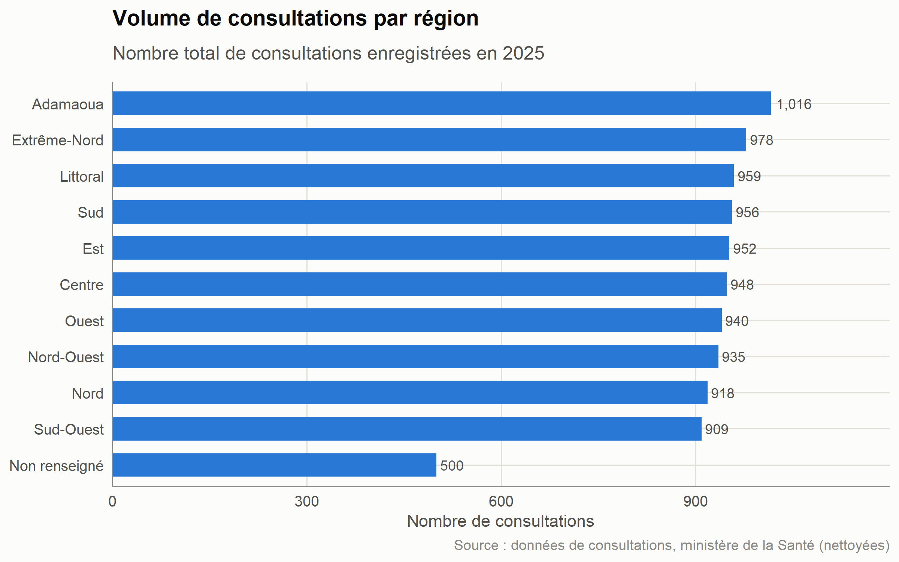
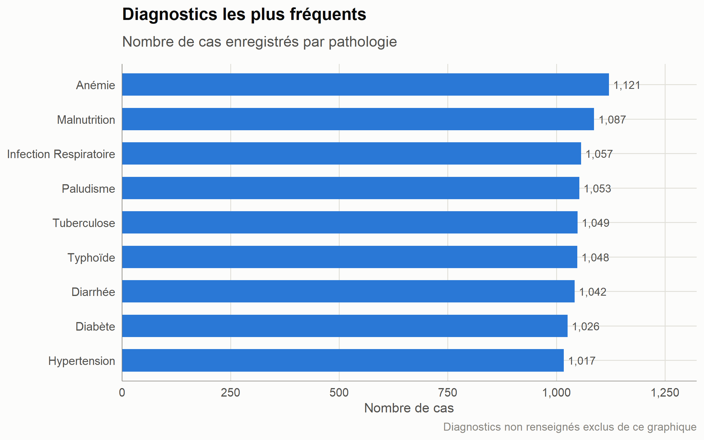
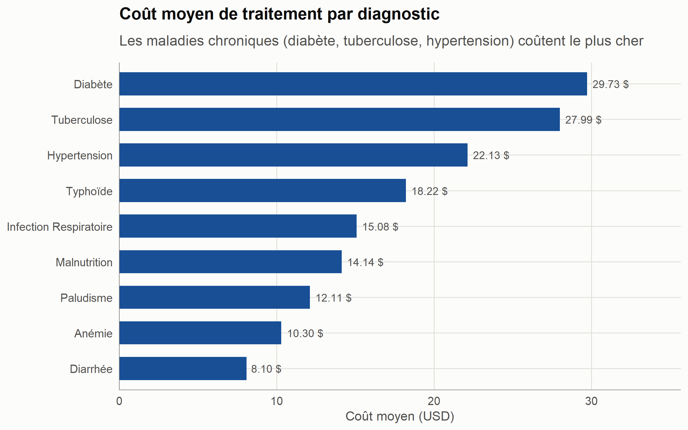
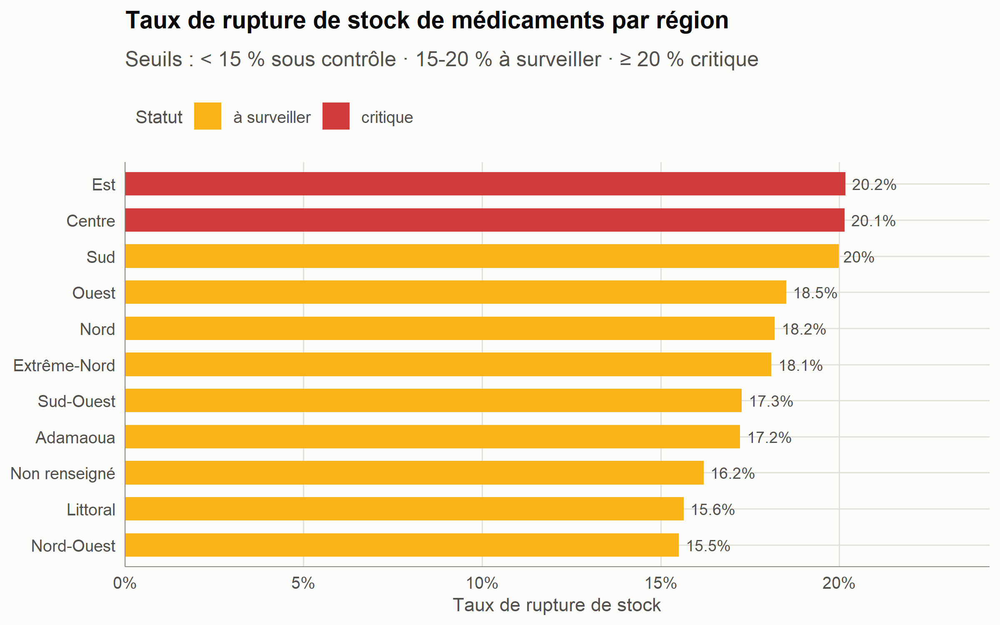
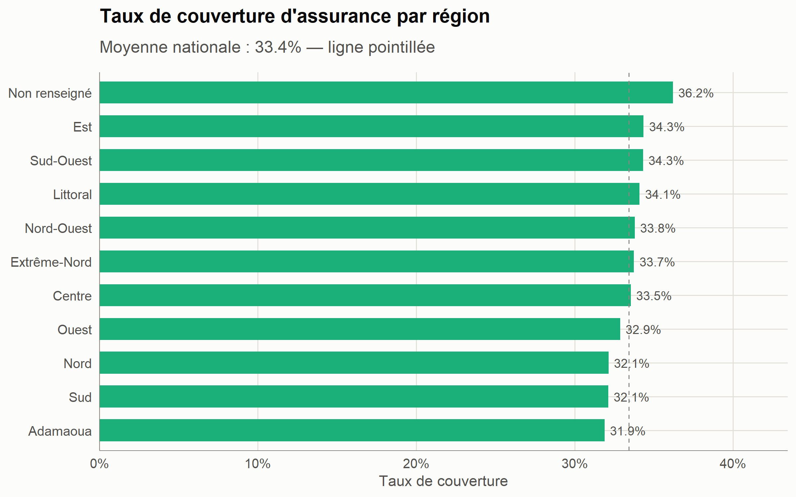
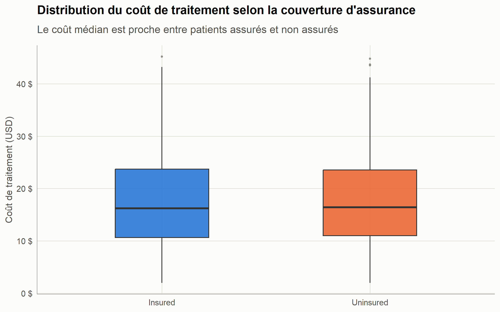
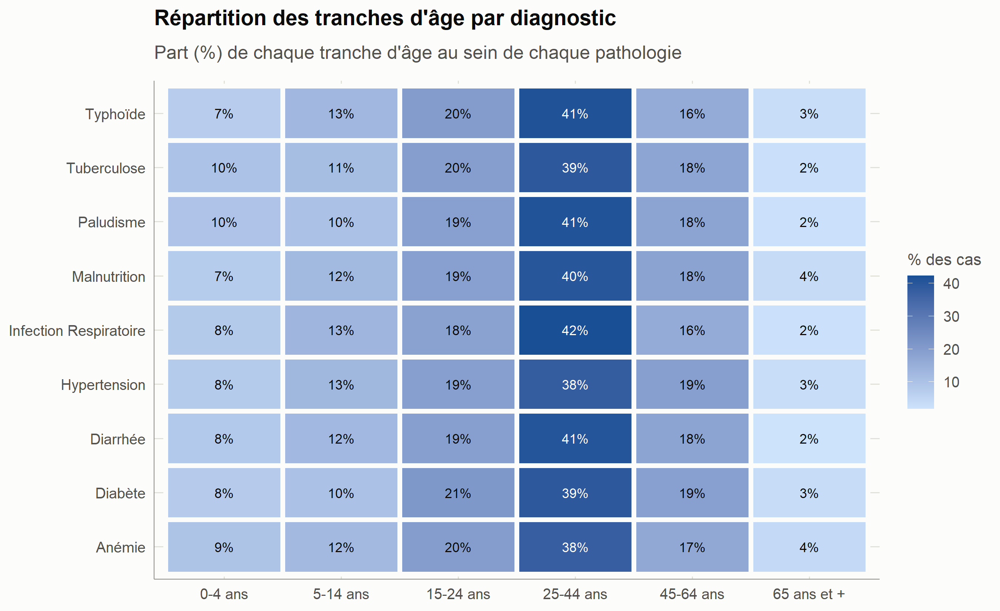
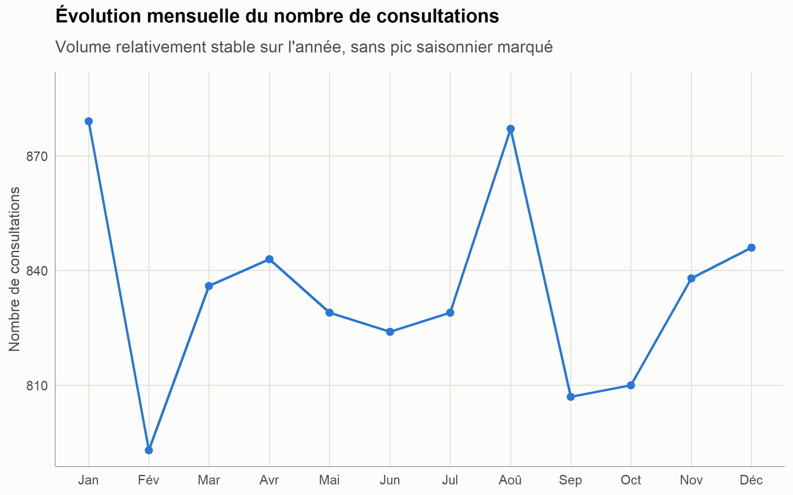

```{r setup, include=FALSE}
knitr::opts_chunk$set(echo = FALSE, warning = FALSE, message = FALSE,
                       fig.align = "center", out.width = "100%")
source("../scripts/00_utils.R")
library(readr); library(dplyr); library(knitr); library(kableExtra); library(scales)

df <- read_csv("../data/clean/consultations_final.csv", show_col_types = FALSE,
                locale = locale(encoding = "UTF-8")) |> restaurer_facteurs()
rapport_qualite <- read_csv("../data/clean/rapport_qualite.csv", show_col_types = FALSE)

tab <- function(nom) read_csv(file.path("../resultats/tables", paste0(nom, ".csv")),
                               show_col_types = FALSE, locale = locale(encoding = "UTF-8"))

joli_tableau <- function(d, ...) {
  kable(d, ...) |> kable_styling(bootstrap_options = c("striped", "hover", "condensed"), full_width = TRUE)
}
```

## Contexte

Un ministère de la Santé collecte des données de consultations dans **150 établissements de santé**, répartis dans les **10 régions** du Cameroun. Ces données, extraites telles que saisies sur le terrain, contiennent les défauts typiques d'un système d'information sanitaire réel : valeurs manquantes, doublons, fautes de frappe, formats de date incohérents et valeurs aberrantes.

Ce rapport documente le traitement complet de ces données — de l'import brut jusqu'aux recommandations opérationnelles — en suivant le workflow standard d'un(e) Data Analyst : **import → exploration → nettoyage → transformation → analyse business → visualisation → statistiques descriptives → dashboard → reporting → recommandations**.

- **Volume traité :** `r comma(nrow(df))` consultations valides après nettoyage (sur `r comma(rapport_qualite$valeur[rapport_qualite$etape == "Lignes brutes"])` lignes brutes)
- **Patients uniques :** `r comma(n_distinct(df$patient_id))`
- **Période couverte :** `r format(min(df$consultation_date), "%d/%m/%Y")` – `r format(max(df$consultation_date), "%d/%m/%Y")`

---

## Méthodologie

### Import et exploration

Le fichier brut (`consultations_cameroun.csv`, 10 300 lignes, 12 colonnes) a été importé et systématiquement audité avant toute correction. Cette étape d'exploration a révélé cinq familles de problèmes :

| Problème détecté | Ampleur |
|---|---|
| Valeurs manquantes (région, genre, diagnostic, coût, assurance) | ~5 à 8 % par champ |
| Doublons stricts | 232 lignes identiques |
| Doublons patient + date | 289 groupes (saisie en double) |
| Catégories incohérentes (région, genre) | ex. « CENTER », « Ctr », « centre », « SW », « M », « Masculin » |
| Dates incohérentes | 200 lignes au format JJ/MM/AAAA au lieu de AAAA-MM-JJ |
| Valeurs aberrantes | âges négatifs ou > 100 ans ; coûts négatifs ou valant 50 000 USD |

### Nettoyage

Chaque problème a été traité avec une règle explicite et documentée (voir `scripts/02_nettoyage.R`) :

```{r entonnoir}
rapport_qualite |>
  rename(Étape = etape, Valeur = valeur) |>
  mutate(Valeur = comma(Valeur, accuracy = 1)) |>
  joli_tableau(caption = "Entonnoir de nettoyage")
```

**Choix méthodologique important :** les valeurs manquantes catégorielles ont été conservées sous une étiquette explicite *« Non renseigné »* plutôt que de supprimer la ligne — chaque ligne conserve sa valeur pour les autres analyses. Les variables numériques manquantes ou aberrantes (âge, coût) sont conservées comme `NA` et systématiquement exclues des calculs via `na.rm = TRUE`, plutôt qu'imputées — une imputation par la moyenne aurait artificiellement resserré la distribution des coûts et biaisé les analyses financières.

### Transformation

Les variables suivantes ont été dérivées pour permettre les analyses métier :

- **Temporelles :** année, mois, trimestre, jour de la semaine
- **Démographiques :** tranche d'âge (6 classes, de 0-4 ans à 65 ans et +)
- **Financières :** catégorie de coût (Faible / Modéré / Élevé)
- **Indicateurs :** rupture de stock (booléen), couverture d'assurance (booléen), ligne incomplète (booléen, utilisé pour le suivi qualité)

---

## Résultats de l'analyse business

### Où se concentre l'activité de soins ?

Le volume de consultations est **remarquablement équilibré entre les 10 régions** (de 909 à 1 016 consultations, soit un écart de moins de 12 %) — aucune région ne concentre disproportionnellement l'activité.



### Quels diagnostics dominent, et à quel coût ?

Les 9 pathologies suivies représentent chacune entre 10,7 % et 11,8 % des cas diagnostiqués : il n'y a pas de pathologie dominante, mais un **fardeau partagé entre maladies infectieuses aiguës et maladies chroniques**.



Le coût moyen de traitement révèle en revanche un écart net : les **maladies chroniques (diabète, tuberculose, hypertension) coûtent 2 à 3 fois plus cher** à traiter que les pathologies infectieuses aiguës (diarrhée, anémie, paludisme).

```{r cout-diag}
tab("cout_moyen_diagnostic") |>
  rename(Diagnostic = diagnosis, N = n, `Coût moyen (USD)` = cout_moyen, `Coût médian (USD)` = cout_median) |>
  joli_tableau()
```



### Ruptures de stock de médicaments : où est l'urgence ?

Le taux de rupture de stock national s'élève à **`r round(100 * mean(df$en_rupture_stock), 1)` %**, avec un écart régional marqué : les régions **Est, Centre et Sud dépassent le seuil critique de 20 %**, contre 15,5 % dans le Nord-Ouest.



Au niveau des établissements (parmi ceux ayant au moins 20 consultations), dix structures dépassent 26 % de rupture de stock — ce sont les cibles prioritaires pour une intervention logistique :

```{r rupture-etab}
tab("rupture_par_etablissement") |>
  head(10) |>
  rename(Région = region, District = district, Établissement = facility_name,
         N = n, `Rupture de stock (%)` = taux_rupture_pct) |>
  joli_tableau()
```

### Couverture d'assurance et accès financier

Seulement **`r round(100 * mean(df$est_assure), 1)` % des consultations concernent un patient assuré** — la grande majorité des patients paie donc les soins directement de leur poche. Le taux de couverture est relativement homogène entre régions (32-34 %), ce qui indique un problème structurel national plutôt qu'un déficit localisé.



Fait notable : le coût moyen de traitement est quasi identique entre patients assurés et non assurés (~17,4 USD) — l'assurance ne semble pas orienter les patients vers des soins plus coûteux, ni les non-assurés vers des soins au rabais.



### Qui sont les patients touchés par chaque pathologie ?

La tranche **25-44 ans concentre 38 à 42 % des cas**, toutes pathologies confondues — cohérent avec une population majoritairement jeune. Aucune pathologie ne montre une concentration marquée sur les enfants ou les personnes âgées dans ce jeu de données.



### Évolution mensuelle

Le volume de consultations reste stable au fil de l'année (807 à 879 consultations mensuelles), **sans pic saisonnier marqué** — y compris pour le paludisme, qui ne montre pas de recrudescence pendant la saison des pluies dans cet échantillon.



---

## Statistiques descriptives

```{r stats-globales}
bind_rows(
  read_csv("../resultats/tables/stats_age_global.csv", show_col_types = FALSE) |> mutate(Variable = "Âge (ans)"),
  read_csv("../resultats/tables/stats_cout_global.csv", show_col_types = FALSE) |> mutate(Variable = "Coût de traitement (USD)")
) |>
  select(Variable, n, moyenne, mediane, ecart_type, variance, min, q1, q3, max) |>
  rename(N = n, Moyenne = moyenne, Médiane = mediane, `Écart-type` = ecart_type,
         Variance = variance, Min = min, Q1 = q1, Q3 = q3, Max = max) |>
  joli_tableau(caption = "Statistiques descriptives globales")
```

L'âge moyen des patients est de `r round(mean(df$patient_age, na.rm=TRUE),1)` ans (médiane `r round(median(df$patient_age, na.rm=TRUE),1)` ans), pour une population qui s'étend de `r round(min(df$patient_age, na.rm=TRUE))` à `r round(max(df$patient_age, na.rm=TRUE))` ans une fois les valeurs aberrantes exclues.

---

## Le dashboard interactif

Un dashboard Shiny (`app/app.R`) donne accès à l'ensemble de ces analyses de façon interactive, avec filtres dynamiques (période, région, diagnostic, type de consultation, statut d'assurance) et six vues : Vue d'ensemble, Analyse géographique, Analyse clinique, Analyse financière, Qualité des données, et Données détaillées (export CSV inclus).

Pour le lancer :

```r
shiny::runApp("app")
```

---

## Recommandations

### 1. Cibler l'approvisionnement en médicaments sur les zones critiques

**Constat :** le taux de rupture de stock dépasse 20 % dans les régions Est, Centre et Sud, et atteint 27 à 34 % dans dix établissements spécifiques (Ebolowa, Batouri, Kumba, Maroua, Yaoundé I, Pitoa, Bamenda, Guider).
**Action :** prioriser le réapprovisionnement et le suivi logistique sur ces dix établissements avant d'agir au niveau régional — c'est là que l'impact sera le plus rapide et le plus mesurable.

### 2. Étendre la couverture d'assurance santé

**Constat :** seulement 1 patient sur 3 est assuré, de façon homogène dans toutes les régions — un problème structurel, pas localisé.
**Action :** un programme national d'extension de la couverture (assurance communautaire, subvention ciblée) aura plus d'impact qu'une intervention région par région.

### 3. Alléger le coût des maladies chroniques

**Constat :** diabète, tuberculose et hypertension coûtent 2 à 3 fois plus cher à traiter que les pathologies infectieuses aiguës, et touchent une population qui recourt majoritairement aux soins sans assurance.
**Action :** envisager une prise en charge différenciée ou un forfait de soins chronique subventionné, en priorité pour ces trois pathologies.

### 4. Fiabiliser la collecte de données à la source

**Constat :** 5 à 8 % de valeurs manquantes par champ, doublons de saisie, formats de date incohérents, catégories en texte libre (région, genre) génératrices de fautes de frappe.
**Action :** remplacer les champs texte libre par des menus déroulants standardisés dans l'outil de saisie, ajouter une validation de plage sur l'âge et le coût à la saisie, et un contrôle de doublon (patient + date) avant l'enregistrement. Ces corrections coûtent peu à mettre en œuvre et amélioreraient durablement la fiabilité de toutes les analyses futures.

### 5. Poursuivre le suivi avec le dashboard

**Constat :** le dashboard permet déjà de filtrer et suivre ces indicateurs en continu.
**Action :** en faire l'outil de revue mensuelle du programme, avec un focus particulier sur l'onglet "Qualité des données" pour suivre l'amélioration de la collecte après mise en œuvre de la recommandation n°4.

---

## Conclusion

Ce projet illustre le cycle complet d'un projet de data analytics appliqué à la santé publique : des données brutes, imparfaites et non exploitables en l'état, ont été transformées en un ensemble fiable et documenté, puis en indicateurs métier concrets et en recommandations actionnables. Les trois enseignements les plus importants — **ruptures de stock concentrées sur des établissements identifiables, couverture d'assurance structurellement faible, et surcoût des maladies chroniques** — donnent au programme des leviers d'action précis plutôt que des constats généraux.
